# TraceKit JS

TraceKit JS is a lightweight, security-first **request correlation** SDK for
Node.js microservices. It keeps a small trace context available across async
work, propagates IDs across HTTP and message boundaries, and enriches logs —
without becoming a full APM product.

**Repository:** [Manavpreeet/tracekit-js](https://github.com/Manavpreeet/tracekit-js)

---

## Table of contents

- [Why use TraceKit](#why-use-tracekit)
- [How it works (diagrams)](#how-it-works-diagrams)
  - [Feature map](#feature-map-all-packages)
  - [Trace context model](#trace-context-model)
  - [Per-package feature diagrams](#per-package-feature-diagrams)
- [TraceKit vs cls-rtracer](#tracekit-vs-cls-rtracer)
- [Packages and adapters](#packages-and-adapters)
- [Security model](#security-model)
- [Architecture](#architecture)
- [Core behavior and configuration](#core-behavior-and-configuration)
- [Installation](#installation)
- [Quick start](#quick-start)
- [Queue and messaging propagation](#queue-and-messaging-propagation)
- [Migrating from cls-rtracer](#migrating-from-cls-rtracer)
- [Performance](#performance)
- [Examples](#examples)
- [Development](#development)

---

## Why use TraceKit

In a distributed system, one user action often crosses multiple HTTP services,
queues, and workers. Without consistent correlation, each service logs in
isolation and incidents take longer to debug.

TraceKit provides:

- **`requestId`** — identifies this hop (often per HTTP request or job)
- **`correlationId`** — stable ID for the broader user/action chain
- **Optional W3C `traceparent`** — `traceId` / `parentId` on ingress when present
- **Safe propagation** — headers, job metadata, and SNS/SQS message attributes

TraceKit is **not** OpenTelemetry, Datadog, or Sentry. It does not collect
spans, metrics dashboards, bodies, or global monkey-patching. Use it for
lightweight correlation; add APM separately if you need waterfalls and service
maps.

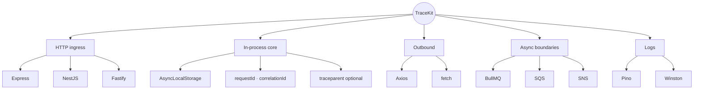

---

## How it works (diagrams)

### End-to-end distributed flow

A typical platform path: API receives a request, publishes an event, a queue
delivers work, and a worker logs with the same IDs.

```mermaid
flowchart LR
  Client[Client / Browser]
  API[API Service\n@tracekit/nest]
  SNS[Amazon SNS\n@tracekit/sns]
  SQS[Amazon SQS\n@tracekit/sqs]
  Worker[Worker\n@tracekit/bullmq]
  Logs[(Logs\n@tracekit/pino)]

  Client -->|"HTTP + x-request-id"| API
  API -->|"Publish + __tracekit attr"| SNS
  SNS --> SQS
  SQS -->|"processSqsMessageWithTrace"| Worker
  API --> Logs
  Worker --> Logs
```

### In-process architecture

Ingress adapters create context once per request. Everything else reads ALS or
serializes a carrier at boundaries.

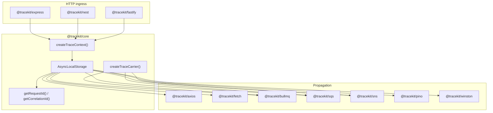

### HTTP request lifecycle

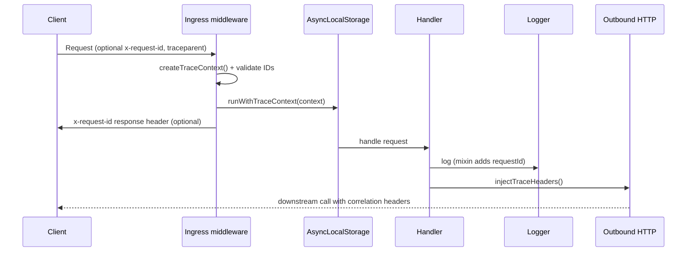

### Carrier at async boundaries

Jobs and messages store a minimal JSON carrier under **`__tracekit`**.

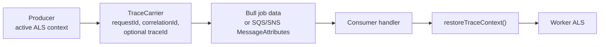

### Feature map (all packages)

Every published package and where it sits in the request lifecycle.

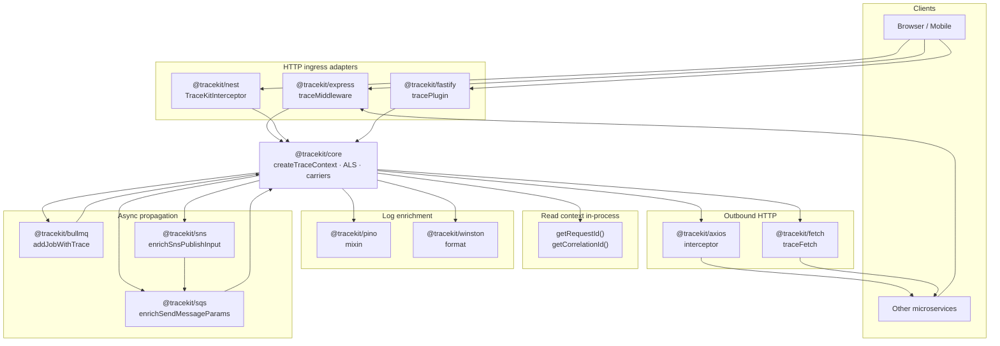

### Trace context model

How the three ID types relate on a single hop.

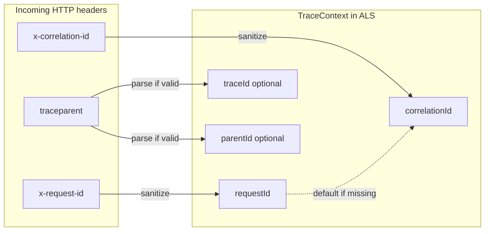

### Per-package feature diagrams

#### `@tracekit/core` — context engine

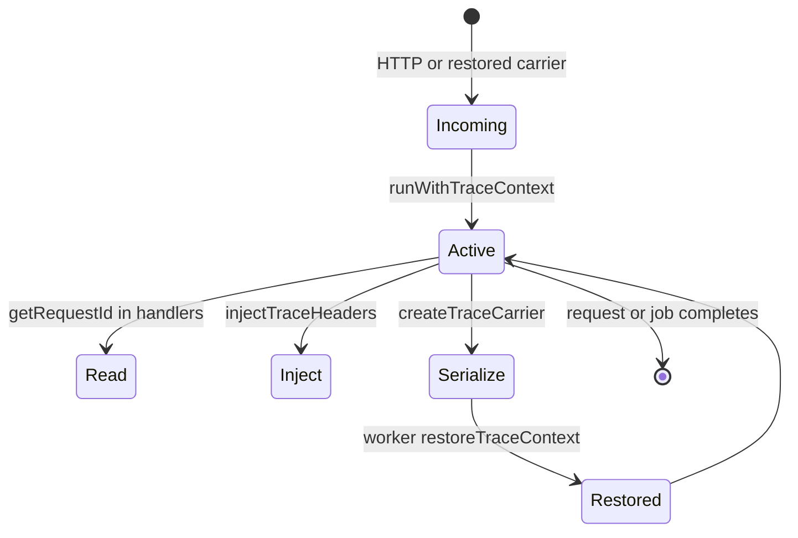

#### `@tracekit/express` — Express ingress

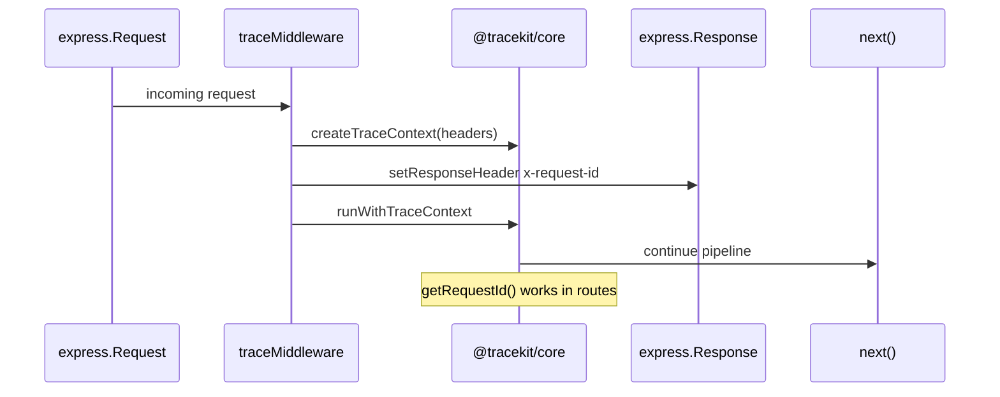

#### `@tracekit/nest` — NestJS (Express or Fastify)

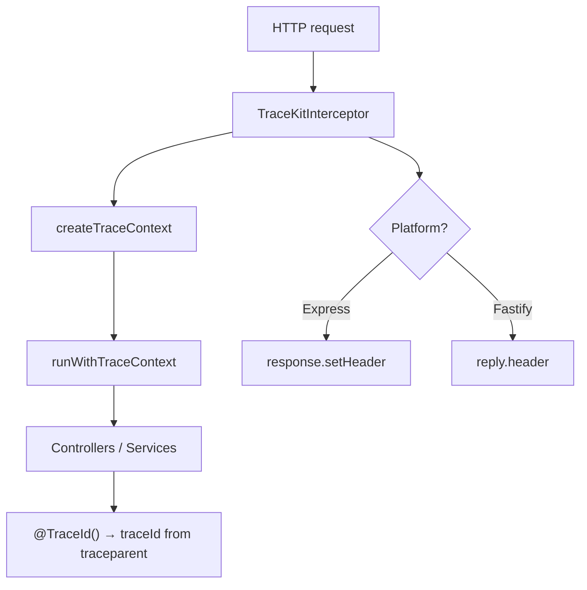

#### `@tracekit/fastify` — standalone Fastify

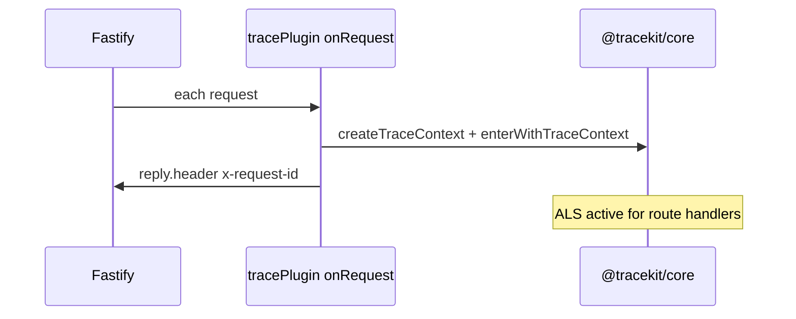

#### `@tracekit/axios` — outbound Axios

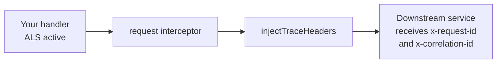

#### `@tracekit/fetch` — outbound fetch

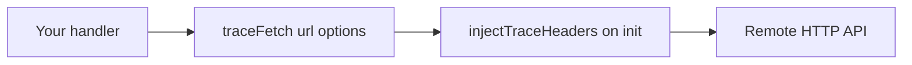

#### `@tracekit/pino` and `@tracekit/winston` — logs

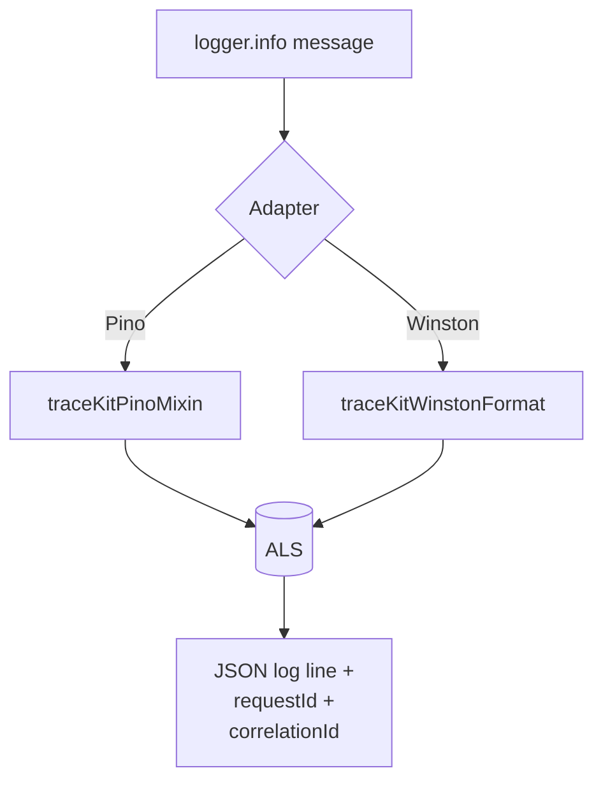

#### `@tracekit/bullmq` — Redis queues

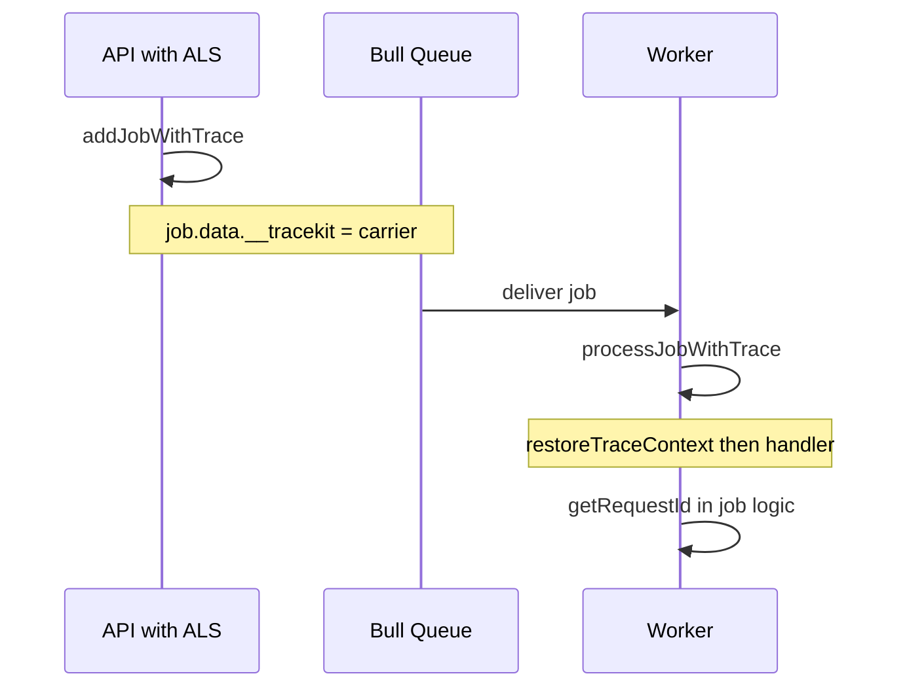

#### `@tracekit/sqs` — Amazon SQS

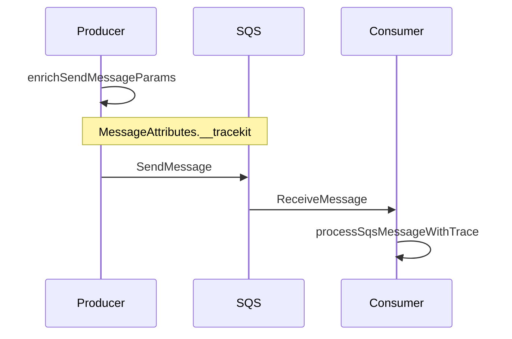

#### `@tracekit/sns` — Amazon SNS

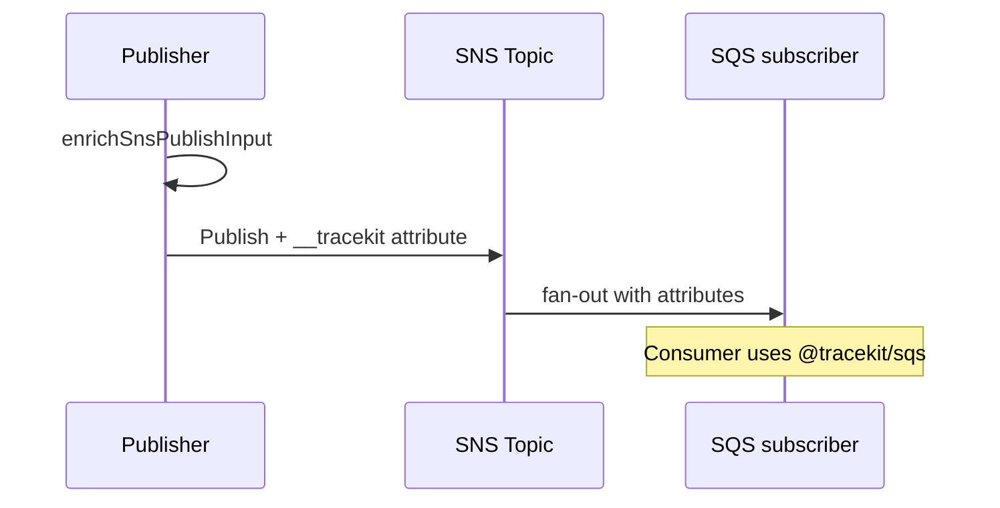

### Service-to-service HTTP chain

Two APIs both running TraceKit — IDs flow through headers only.

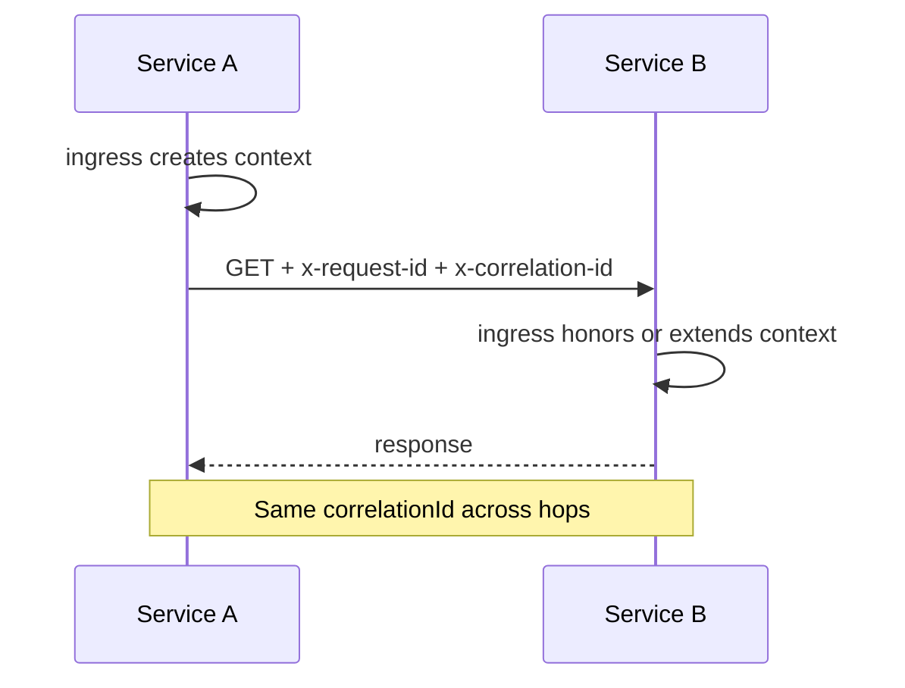

### Incoming ID validation

Unsafe client-supplied IDs never enter ALS.

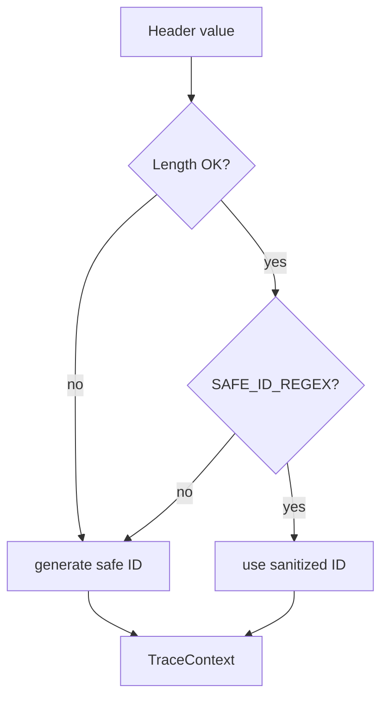

---

## TraceKit vs cls-rtracer

Both use **`AsyncLocalStorage`** so you can read an ID anywhere in the async
chain without threading `req` through every function.

| | cls-rtracer | TraceKit |
|---|-------------|----------|
| **Primary goal** | Request ID inside one Node HTTP process | Correlation across HTTP, logs, queues, AWS messaging |
| **Read ID** | `rtracer.id()` | `getRequestId()`, `getCorrelationId()` |
| **Correlation ID** | Not first-class | `correlationId` (defaults to `requestId`) |
| **W3C traceparent** | Not built in | Optional parse → `traceId` / `parentId` |
| **Outgoing HTTP** | Manual | `@tracekit/axios`, `@tracekit/fetch` |
| **Bull / SQS / SNS** | Manual | `@tracekit/bullmq`, `@tracekit/sqs`, `@tracekit/sns` |
| **NestJS module** | Wire middleware yourself | `@tracekit/nest` (Express + Fastify platforms) |
| **Incoming ID validation** | Permissive | Strict safe IDs; invalid values replaced |
| **Typical cost** | Baseline | ~+0.17 MB/process, ~+10–15% ALS micro-ops (negligible vs API latency) |

**When cls-rtracer is enough:** single service, HTTP-only logs, manual queue IDs.

**When TraceKit fits better:** auth → platform → SNS/SQS → Bull workers with the
same IDs in every log line.

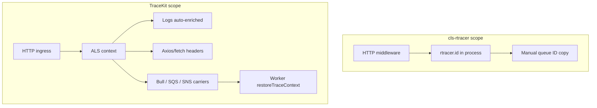

---

## Packages and adapters

Install **only what each service needs** to limit bundle size and memory.

| Package | Use when |
|---------|----------|
| `@tracekit/core` | Any Node.js service; ALS, carriers, header helpers |
| `@tracekit/express` | Express HTTP ingress |
| `@tracekit/nest` | NestJS with **Express or Fastify** platform |
| `@tracekit/fastify` | Standalone Fastify (not Nest + Fastify) |
| `@tracekit/axios` | Axios outgoing requests |
| `@tracekit/fetch` | Native `fetch` outgoing requests |
| `@tracekit/pino` | Pino log mixin |
| `@tracekit/winston` | Winston format |
| `@tracekit/bullmq` | BullMQ producers and workers |
| `@tracekit/sqs` | Amazon SQS send/receive |
| `@tracekit/sns` | Amazon SNS publish |

### NestJS platform matrix

| Your platform | TraceKit package | Notes |
|---------------|------------------|-------|
| `@nestjs/platform-express` | `@tracekit/nest` | Uses `response.setHeader()` |
| `@nestjs/platform-fastify` | `@tracekit/nest` | Uses `reply.header()` — do **not** also register `@tracekit/fastify` |

### Typical stacks

| Service type | Packages |
|--------------|----------|
| Public API (Nest + Fastify) | `core`, `nest`, `pino` |
| API + internal HTTP calls | add `axios` or `fetch` |
| API + background jobs | add `bullmq` or `sqs` |
| Event publisher | add `sns` |
| Queue worker | `core`, `bullmq` or `sqs`, `pino` |

Per-package READMEs live under `packages/*/README.md`.

```mermaid
flowchart LR
  CORE["@tracekit/core"] --> EXPRESS
  CORE --> NEST
  CORE --> FASTIFY
  CORE --> AXIOS
  CORE --> FETCH
  CORE --> PINO
  CORE --> WINSTON
  CORE --> BULLMQ
  CORE --> SQS_PKG
  CORE --> SNS_PKG

  EXPRESS["express"]
  NEST["nest"]
  FASTIFY["fastify"]
  AXIOS["axios"]
  FETCH["fetch"]
  PINO["pino"]
  WINSTON["winston"]
  BULLMQ["bullmq"]
  SQS_PKG["sqs"]
  SNS_PKG["sns"]
```

### Typical deployment topology

```mermaid
flowchart TB
  GW[Gateway / Auth\nnest + pino] --> PLAT[Platform API\nnest + axios]
  PLAT --> SNSP[sns publish]
  SNSP --> SQSC[sqs consumer]
  PLAT --> BULLQ[bullmq enqueue]
  SQSC --> WRK1[Worker sqs + pino]
  BULLQ --> WRK2[Worker bullmq + pino]
```

---

## Security model

TraceKit follows a **conservative** model: correlate safely, never exfiltrate
sensitive request data by default.

### What is stored in context

Only small correlation fields in `AsyncLocalStorage`:

- `requestId`, `correlationId`
- optional `traceId`, `parentId` (from valid `traceparent`)
- `source`, `startedAt`

### What is never captured automatically

- `authorization`, `cookie`, API keys, JWTs
- Request or response **bodies**
- Email, phone, session identifiers

### Incoming IDs

- Validated with `SAFE_ID_REGEX` and `maxHeaderLength` (default 128)
- Invalid or unsafe incoming values are **ignored** and replaced with generated IDs

### Outgoing propagation

By default only these headers are injected:

- `x-request-id`
- `x-correlation-id`

Set `overwriteOutgoingHeaders: true` only when you intentionally need to replace
existing values.

### Queues and messaging

The `__tracekit` carrier must contain **only** correlation fields. Never put
PII, tokens, or JWTs in job metadata or message attributes.

### Logging

- `exposeSensitiveDataInLogs: false` (default)
- Use `sensitiveLogAllowlist` only after an explicit compliance review

```mermaid
flowchart TB
  subgraph allowed [Allowed in context and carriers]
    RID2[requestId]
    CID2[correlationId]
    TID[traceId / parentId]
  end

  subgraph blocked [Never stored by TraceKit]
    AUTH[Authorization / cookies]
    BODY[Request / response body]
    PII[PII / JWT / API keys]
  end

  HTTP[HTTP request] -->|sanitize headers only| allowed
  HTTP -.->|ignored| blocked
  allowed -->|x-request-id x-correlation-id| OUT[Outbound headers]
  allowed -->|__tracekit JSON| QUEUE[Queues / SNS / SQS]
```

---

## Architecture

### Layers

1. **Ingress** — Express, Nest, or Fastify adapter calls `createTraceContext()`
   from incoming headers, then `runWithTraceContext()`.
2. **Core** — `AsyncLocalStorage` holds `TraceContext` for the lifetime of the
   request or restored job.
3. **Egress** — Log mixins read ALS; HTTP clients call `injectTraceHeaders()`;
   queue/messaging helpers attach `__tracekit` carriers.

### Propagation rules

| Step | Mechanism |
|------|-----------|
| HTTP ingress | Parse headers → `createTraceContext()` → ALS |
| In-process | `getRequestId()` / `getCorrelationId()` |
| HTTP egress | `injectTraceHeaders()` on axios/fetch |
| Async boundary | `createTraceCarrier()` → `__tracekit` on job or message attribute |
| Worker | `restoreTraceContext({ trace })` → `runWithTraceContext()` |

```mermaid
flowchart TD
  subgraph layer1 [1. Ingress]
    I1[Read headers]
    I2[createTraceContext]
    I3[runWithTraceContext]
    I1 --> I2 --> I3
  end

  subgraph layer2 [2. Core ALS]
    A1[TraceContext store]
  end

  subgraph layer3 [3. Egress]
    E1[Logs]
    E2[HTTP clients]
    E3[Queues / messaging]
  end

  layer1 --> layer2
  layer2 --> layer3
```

### Custom transports

Use `@tracekit/core` directly:

```ts
import {
  createTraceCarrier,
  extractTraceCarrierFromMessageAttributes,
  getTraceContext,
  injectTraceMessageAttributes,
  restoreTraceContext,
  runWithTraceContext
} from "@tracekit/core";
```

---

## Core behavior and configuration

### Context shape

```ts
type TraceContext = {
  requestId: string;
  correlationId: string;
  traceId?: string;
  parentId?: string;
  source: "incoming" | "generated" | "restored";
  startedAt: number;
};
```

### Incoming header resolution order

1. Valid W3C `traceparent` (when `respectTraceparent: true`)
2. Valid request header (`requestHeaderName`, default `x-request-id`)
3. Valid correlation header (`correlationHeaderName`, default `x-correlation-id`)
4. Generated safe IDs

```mermaid
flowchart TD
  START[Incoming request] --> TP{Valid traceparent?}
  TP -->|yes| PARSE[Set traceId + parentId]
  TP -->|no| REQ
  PARSE --> REQ{Valid x-request-id?}
  REQ -->|yes| RUSE[Use requestId]
  REQ -->|no| RGEN[Generate requestId]
  RUSE --> CORR
  RGEN --> CORR{Valid x-correlation-id?}
  CORR -->|yes| CUSE[Use correlationId]
  CORR -->|no| CDEF[correlationId = requestId]
  CUSE --> DONE[TraceContext in ALS]
  CDEF --> DONE
```

### Configuration options

| Option | Default | Purpose |
|--------|---------|---------|
| `requestHeaderName` | `x-request-id` | Incoming/outgoing request ID header |
| `correlationHeaderName` | `x-correlation-id` | Correlation header |
| `responseHeaderName` | `x-request-id` | Response header when exposed |
| `exposeResponseHeader` | `true` | Set response header on ingress |
| `allowIncomingRequestId` | `true` | Honor safe incoming request IDs |
| `respectTraceparent` | `true` | Parse W3C trace context |
| `generator` | `"uuid"` | `"uuid"`, `"nanoid"`, or custom function |
| `maxHeaderLength` | `128` | Max length for sanitized IDs |
| `overwriteOutgoingHeaders` | `false` | Replace existing outbound headers |

Example — internal API with no response header or traceparent parsing:

```ts
TraceKitModule.forRoot({
  respectTraceparent: false,
  exposeResponseHeader: false
});
```

### Core API reference

| Function | Role |
|----------|------|
| `createTraceContext()` | Build context from incoming headers |
| `runWithTraceContext()` | Run callback inside ALS |
| `enterWithTraceContext()` | Fastify-style enter (used by fastify plugin) |
| `getTraceContext()` | Read full context |
| `getRequestId()` / `getCorrelationId()` | Read IDs |
| `injectTraceHeaders()` | Merge IDs into outbound header map |
| `createTraceCarrier()` | Serialize for queues/messages |
| `restoreTraceContext()` | Rebuild context in workers |
| `setResponseHeader()` | Express `setHeader` or Fastify `header` |

---

## Installation

**Requirements:** Node.js `>=18.18.0`

### Published packages

```bash
# Minimal HTTP API
pnpm add @tracekit/core @tracekit/express @tracekit/pino

# Service-to-service HTTP
pnpm add @tracekit/core @tracekit/express @tracekit/axios

# NestJS (Express or Fastify platform)
pnpm add @tracekit/core @tracekit/nest

# Queues
pnpm add @tracekit/core @tracekit/bullmq

# AWS messaging
pnpm add @tracekit/core @tracekit/sqs @tracekit/sns
```

### Monorepo development

```bash
git clone https://github.com/Manavpreeet/tracekit-js.git
cd tracekit-js
pnpm install
pnpm build
```

---

## Quick start

The diagrams in [Per-package feature diagrams](#per-package-feature-diagrams) show
how each adapter participates in the same ALS context. Below are minimal code
snippets for each.

### Express

```ts
import express from "express";
import { getRequestId } from "@tracekit/core";
import { traceMiddleware } from "@tracekit/express";

const app = express();
app.use(traceMiddleware());

app.get("/ping", (_req, res) => {
  res.json({ requestId: getRequestId() });
});
```

### NestJS (Express or Fastify)

```ts
import { Module } from "@nestjs/common";
import { TraceKitModule } from "@tracekit/nest";

@Module({
  imports: [TraceKitModule.forRoot()]
})
export class AppModule {}
```

Fastify platform:

```ts
import { NestFactory } from "@nestjs/core";
import {
  FastifyAdapter,
  NestFastifyApplication
} from "@nestjs/platform-fastify";

const app = await NestFactory.create<NestFastifyApplication>(
  AppModule,
  new FastifyAdapter()
);
await app.listen(3000);
```

`@TraceId()` decorator — returns W3C `traceId` when a valid `traceparent` is present:

```ts
import { Controller, Get } from "@nestjs/common";
import { TraceId } from "@tracekit/nest";

@Controller()
export class AppController {
  @Get("/ping")
  ping(@TraceId() traceId: string | undefined) {
    return { traceId };
  }
}
```

### Standalone Fastify

Do **not** use this together with `@tracekit/nest` on the same app.

```ts
import Fastify from "fastify";
import { tracePlugin } from "@tracekit/fastify";

const app = Fastify();
await app.register(tracePlugin);
```

### Pino

```ts
import pino from "pino";
import { traceKitPinoMixin } from "@tracekit/pino";

const logger = pino({ mixin: traceKitPinoMixin });
```

### Winston

```ts
import winston from "winston";
import { traceKitWinstonFormat } from "@tracekit/winston";

const logger = winston.createLogger({
  format: winston.format.combine(traceKitWinstonFormat(), winston.format.json())
});
```

### Axios

```ts
import axios from "axios";
import { attachTraceKitAxiosInterceptor } from "@tracekit/axios";

const client = axios.create();
attachTraceKitAxiosInterceptor(client);
```

### Fetch

```ts
import { traceFetch } from "@tracekit/fetch";

const response = await traceFetch("https://service-b.internal/users");
```

---

## Queue and messaging propagation

The **`__tracekit`** key carries a minimal JSON `TraceCarrier`:

`{ requestId, correlationId, traceId?, parentId? }`

```mermaid
flowchart TB
  subgraph http [HTTP tier]
    API[API service]
  end

  subgraph transports [Transport choice]
    BULL_T[BullMQ job.data]
    SNS_T[SNS MessageAttributes]
    SQS_T[SQS MessageAttributes]
  end

  subgraph workers [Worker tier]
    WB[Bull worker]
    WS[SQS consumer]
  end

  API --> BULL_T --> WB
  API --> SNS_T --> SQS_T --> WS
  API --> SQS_T
```

### BullMQ

Metadata is embedded in **job data** (not Redis headers).

```ts
import { Worker } from "bullmq";
import { addJobWithTrace, processJobWithTrace } from "@tracekit/bullmq";
import { getRequestId } from "@tracekit/core";

await addJobWithTrace(queue, "send-email", { template: "welcome" });

new Worker(
  "send-email",
  processJobWithTrace(async () => {
    console.log(getRequestId());
  }),
  { connection }
);
```

### Amazon SQS

Carrier is stored in **`MessageAttributes.__tracekit`** (String, JSON).

```ts
import { SQSClient, SendMessageCommand } from "@aws-sdk/client-sqs";
import { getRequestId } from "@tracekit/core";
import {
  enrichSendMessageParams,
  processSqsMessageWithTrace
} from "@tracekit/sqs";

const sqs = new SQSClient({});

await sqs.send(
  new SendMessageCommand(
    enrichSendMessageParams({
      QueueUrl: process.env.QUEUE_URL,
      MessageBody: JSON.stringify({ action: "sync" })
    })
  )
);

const handleMessage = processSqsMessageWithTrace(async () => {
  console.log(getRequestId());
});
```

### Amazon SNS

Same **`__tracekit`** message attribute on publish. When SNS fans out to SQS,
ensure attributes are forwarded; consumers use `@tracekit/sqs` to restore context.

```ts
import { SNSClient, PublishCommand } from "@aws-sdk/client-sns";
import { enrichSnsPublishInput } from "@tracekit/sns";

const sns = new SNSClient({});

await sns.send(
  new PublishCommand(
    enrichSnsPublishInput({
      TopicArn: process.env.TOPIC_ARN,
      Message: JSON.stringify({ action: "notify" })
    })
  )
);
```

---

## Migrating from cls-rtracer

```mermaid
flowchart LR
  subgraph bad [Avoid dual ALS]
    R1[cls-rtracer ALS]
    R2[TraceKit ALS]
    R1 -.->|mismatched IDs| APP1[Application code]
    R2 -.-> APP1
  end

  subgraph good [Target state]
    TK[TraceKit only]
    TK --> APP2[Single source of truth]
  end

  bad -->|remove cls-rtracer| good
```

### API mapping

| cls-rtracer | TraceKit |
|-------------|----------|
| `rtracer.expressMiddleware()` | `traceMiddleware()` (`@tracekit/express`) |
| Nest manual middleware | `TraceKitModule.forRoot()` (`@tracekit/nest`) |
| Fastify hook | `tracePlugin` (`@tracekit/fastify`) |
| `rtracer.id()` | `getRequestId()` |
| `rtracer.id({ useHeader: false })` | `createTraceContext()` with config |
| Winston format | `traceKitWinstonFormat()` |
| Manual worker context | `processJobWithTrace()` / `processSqsMessageWithTrace()` |

### Avoid dual ALS

Do **not** run cls-rtracer and TraceKit together long term. That loads two
context systems (~**0.35 MB** extra per process) and can produce **mismatched
IDs** if some code still calls `rtracer.id()`.

Remove cls-rtracer from:

1. HTTP middleware and guards
2. Winston/Pino formatters
3. `package.json` after grep shows zero imports

### Rollout checklist

1. Enable TraceKit ingress on one service (gateway or auth).
2. Switch logs to `@tracekit/pino` or `@tracekit/winston`.
3. Add axios/fetch interceptors for outbound HTTP.
4. Wrap Bull/SQS/SNS producers and consumers.
5. Remove cls-rtracer.
6. Verify end-to-end: HTTP → SNS/SQS → worker logs share `requestId`.

### Verification

- [ ] Safe incoming `x-request-id` is honored
- [ ] Response `x-request-id` when `exposeResponseHeader` is enabled
- [ ] `getRequestId()` works in controllers/services without manual middleware
- [ ] Queue and messaging handlers restore context
- [ ] No remaining `cls-rtracer` imports

---

## Performance

TraceKit is designed to stay **negligible** compared to framework, database,
and network time. Treat microbenchmarks as order-of-magnitude signals, not
production APM.

```mermaid
pie title Typical 50ms API request time budget
  "Business logic + DB" : 49.95
  "TraceKit ALS + headers" : 0.05
```

```mermaid
flowchart LR
  subgraph cost [Where TraceKit spends time]
    ALS[ALS enter/read]
    HDR[Header read/write]
    CAR[Carrier JSON on boundaries]
  end

  subgraph savings [Reduce load]
    S1[One tracing library]
    S2[Packages per service only]
    S3[Carriers on cross-service messages only]
  end

  cost --> savings
```

### Compared to cls-rtracer alone

| Area | Typical impact | Action |
|------|----------------|--------|
| Memory (full swap) | ~+0.17 MB / process | No change needed |
| Memory (both libraries during migration) | ~+0.35 MB / process | Remove cls-rtracer |
| HTTP ALS enter + read | ~+10–15% (~0.007 µs) | No change needed |
| Bull/SQS carrier | sub-µs per message | Use only on boundaries |

At 10,000 HTTP requests, ALS overhead is **under 1 ms** total — roughly
**0.0001%** of a 50 ms API call.

### Minimizing load

| Resource | Highest-impact practices |
|----------|-------------------------|
| **CPU** | One ingress adapter; `respectTraceparent: false` if unused; reduce log volume; don’t call `getRequestId()` in tight loops |
| **Memory** | Single tracing library; install only needed packages; no duplicate context on `req` |
| **Network** | Two small headers on HTTP; put `__tracekit` only on **cross-service** messages, not every internal enqueue |

### Benchmarks (repo root)

```bash
pnpm benchmark          # core: context, ALS, header injection
pnpm benchmark:compare  # TraceKit vs cls-rtracer ALS
pnpm size-check         # dist/ size per package
```

Escalate only if production p95 regresses **>1%** attributable to TraceKit, or
heap grows **>5 MB** with TraceKit alone after cls-rtracer is removed.

---

## Examples

| Example | Path |
|---------|------|
| Express basic | `examples/express-basic` |
| Service-to-service HTTP | `examples/express-service-to-service` |
| BullMQ API + worker | `examples/bullmq-worker` |
| NestJS | `examples/nest-basic` |

```bash
pnpm --filter @tracekit-example/express-basic start
pnpm --filter @tracekit-example/express-service-to-service service:a
pnpm --filter @tracekit-example/express-service-to-service service:b
pnpm --filter @tracekit-example/nest-basic start
pnpm --filter @tracekit-example/bullmq-worker api
pnpm --filter @tracekit-example/bullmq-worker worker
```

BullMQ example uses `REDIS_URL` (default `redis://127.0.0.1:6379`).

---

## Development

```bash
pnpm install
pnpm lint
pnpm test
pnpm typecheck
pnpm build
pnpm benchmark
pnpm benchmark:compare
pnpm size-check
pnpm pack:check      # validate npm tarballs in .pack/
pnpm release:check   # lint + test + typecheck + pack
```

---

## Current status

TraceKit JS is a pnpm monorepo with published-style packages, tests, examples,
and pack validation. Configure npm scope (`@tracekit`), CI, and publish workflow
before releasing to the public registry.
